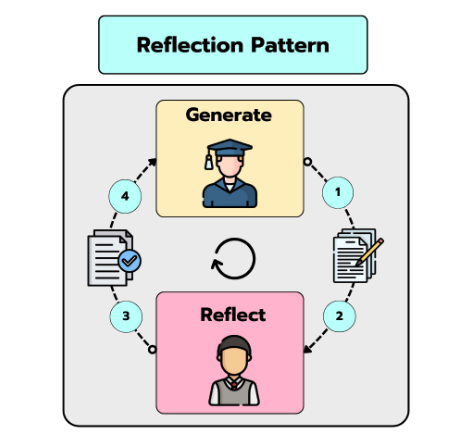
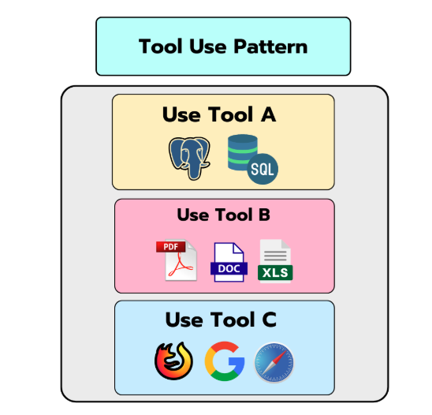
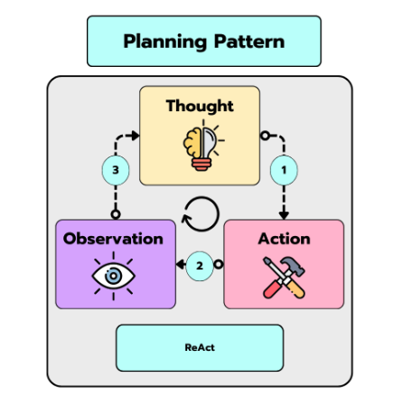
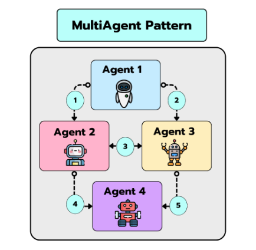
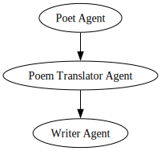

## Table of Contents

- [1. Introduction](#introduction)
  - [1.1 Reflection Pattern](#reflection-pattern)
  - [1.2 Tool Pattern](#tool-pattern)
  - [1.3 Planning Pattern](#planning-pattern)
  - [1.4 Multiagent Pattern](#multiagent-pattern)

- [2. Installation](#installation)
- [3. Groq API Key](#groq-api-key)
- [4. Usage](#usage)
  - [4.1 Using a Reflection Agent - Reflection Pattern](#using-a-reflection-agent---reflection-pattern)
  - [4.2 Creating and Using Tools - Tool Use Pattern](#creating-and-using-tools---tool-use-pattern)
  - [4.3 Reasoning with a ReAct Agent - Planning Pattern](#reasoning-with-a-react-agent---planning-pattern)
  - [4.4 Defining and running a Crew of Agents - MultiAgent Pattern](#defining-and-running-a-crew-of-agents---multiagent-pattern)


## Introduction

This repository contains an implementation of the 4 agentic patterns as defined by Andrew Ng in his DeepLearning.AI [blog article series](https://www.deeplearning.ai/the-batch/how-agents-can-improve-llm-performance/?ref=dl-staging-website.ghost.io).


## The 4 Agentic patterns

### Reflection Pattern

<p align="center">
    
</p>

A very basic pattern.

It allows the LLM to **reflect on its results**, suggesting
modifications, additions, improvements in the writing style, etc.

- Check the [notebook](notebooks/reflection_pattern.ipynb) for a step by step explanation
- Check the [`ReflectionAgent`](src/agentic_patterns/reflection_pattern/reflection_agent.py) for a complete Python implementation

---

### Tool Pattern

<p align="center">
    
</p>

The information stored in the LLM weights is (usually) **not enough** to give accurate and insightful answers to our questions

That's why we need to provide the LLM with ways to access the outside world 🌍

In practice, you can build tools for whatever you want (at the end of the day they are just functions the LLM can use), from a tool that let's you access Wikipedia, another to analyse the content of YouTube videos or calculate difficult integrals in Wolfram Alpha.


- Check the [notebook](notebooks/tool_pattern.ipynb) for a step by step explanation
- Check the [`ToolAgent`](src/agentic_patterns/tool_pattern/tool_agent.py) for a complete Python implementation
- Check the [`Tool`](src/agentic_patterns/tool_pattern/tool.py) for understanding how Tools work under the hood.
---

### Planning Pattern

<p align="center">
    
</p>

Planning Pattern provides ways for the LLM to break a task into **smaller, more easily accomplished subgoals** without losing track of the end goal.

The most paradigmatic example of the planning pattern is the **ReAct** technique, displayed in the diagram above.


- Check the [notebook](notebooks/planning_pattern.ipynb) for a step by step explanation
- Check the [`ReactAgent`](src/agentic_patterns/planning_pattern/react_agent.py) for a complete Python implementation
---

### Multiagent Pattern

<p align="center">
    
</p>

Frameworks like crewAI or AutoGen allow you to create multi-agent applications.

These frameworks implement different variations of the multi-agent pattern, in which tasks are divided into **smaller subtasks executed by different roles** (e.g. one agent can be a software engineer, another a project manager, etc.)


- Check the [notebook](notebooks/multiagent_pattern.ipynb) for a step by step explanation
- Check the [`Agent`](src/agentic_patterns/multiagent_pattern/agent.py) to see how to implement
an `Agent`
---

## Installation

### Install requirements
```sh
pip install -r requirements.txt
```

If you take a look at any of the notebooks in the [notebooks/](notebooks) folder you'll see some helper methods and classes being imported from this library: `agentic-patterns`.

This is the library implemented in the [src/](src) folder, and contains a full implementation of the 4 patterns and related helper methods.


---

## Groq API Key

This project works with [Groq](https://groq.com/) as the LLM provider, so you'll need to create an API Key in this platform.

When you have your API Key copy and paste it in an `.env` file.

The content of this `.env` file should match the structure of the `.env.example`.

---

## Usage

Once you have both library installed and the `.env` file created, you can start playing with the 4 patterns implementation.

Let's see an example of how to put the 4 patterns into practise.

---

### Using a Reflection Agent - Reflection Pattern

Here is an example of how to use a Reflection Agent.

```python
from agentic_patterns import ReflectionAgent

agent = ReflectionAgent()

generation_system_prompt = "You are a Python programmer tasked with generating high quality Python code"

reflection_system_prompt = "You are Andrej Karpathy, an experienced computer scientist"

user_msg = "Generate a Python implementation of the Merge Sort algorithm"


final_response = agent.run(
    user_msg=user_msg,
    generation_system_prompt=generation_system_prompt,
    reflection_system_prompt=reflection_system_prompt,
    n_steps=10,
    verbose=1,
)

print(final_response)
```

### Creating and Using Tools - Tool Use Pattern

An example of how to create a custom tool and bind it to a Tool Agent.

First, let's create the tool. In this case, I'll be creating a tool for interacting with Hacker News. To define a tool, we just need to decorate the Python function with the `@tool`decorator.

```python
import json
import requests
from agentic_patterns.tool_pattern.tool import tool
from agentic_patterns.tool_pattern.tool_agent import ToolAgent

@tool
def fetch_top_hacker_news_stories(top_n: int):
    """
    Fetch the top stories from Hacker News.

    This function retrieves the top `top_n` stories from Hacker News using the Hacker News API.
    Each story contains the title, URL, score, author, and time of submission. The data is fetched
    from the official Firebase Hacker News API, which returns story details in JSON format.

    Args:
        top_n (int): The number of top stories to retrieve.
    """
    top_stories_url = 'https://hacker-news.firebaseio.com/v0/topstories.json'

    try:
        response = requests.get(top_stories_url)
        response.raise_for_status()  # Check for HTTP errors

        # Get the top story IDs
        top_story_ids = response.json()[:top_n]

        top_stories = []

        # For each story ID, fetch the story details
        for story_id in top_story_ids:
            story_url = f'https://hacker-news.firebaseio.com/v0/item/{story_id}.json'
            story_response = requests.get(story_url)
            story_response.raise_for_status()  # Check for HTTP errors
            story_data = story_response.json()

            # Append the story title and URL (or other relevant info) to the list
            top_stories.append({
                'title': story_data.get('title', 'No title'),
                'url': story_data.get('url', 'No URL available'),
            })

        return json.dumps(top_stories)

    except requests.exceptions.RequestException as e:
        print(f"An error occurred: {e}")
        return []
```

Next, let's define the Agent.

```python
tool_agent = ToolAgent(tools=[fetch_top_hacker_news_stories])

output = tool_agent.run(user_msg="Tell me the top 5 Hacker News stories right now")

print(output)
```

### Reasoning with a ReAct Agent - Planning Pattern

As a paradigmatic example of the Planning Pattern, `agentic-patterns` offers an implementation of a ReAct Agent.

The `ReactAgent` is an evolution of the `ToolAgent`, extending its planning and reasoning capabilities.

As we did before, we'll begin by defining the tools. In this case, I'll create three.

```python
@tool
def sum_two_elements(a: int, b: int) -> int:
    """
    Computes the sum of two integers.

    Args:
        a (int): The first integer to be summed.
        b (int): The second integer to be summed.

    Returns:
        int: The sum of `a` and `b`.
    """
    return a + b


@tool
def multiply_two_elements(a: int, b: int) -> int:
    """
    Multiplies two integers.

    Args:
        a (int): The first integer to multiply.
        b (int): The second integer to multiply.

    Returns:
        int: The product of `a` and `b`.
    """
    return a * b

@tool
def compute_log(x: int) -> float | str:
    """
    Computes the logarithm of an integer `x` with an optional base.

    Args:
        x (int): The integer value for which the logarithm is computed. Must be greater than 0.

    Returns:
        float: The logarithm of `x` to the specified `base`.
    """
    if x <= 0:
        return "Logarithm is undefined for values less than or equal to 0."

    return math.log(x)
```

Now, let's create the agent.

```python
from agentic_patterns.planning_pattern.react_agent import ReactAgent

agent = ReactAgent(tools=[sum_two_elements, multiply_two_elements, compute_log])

agent.run(user_msg="I want to calculate the sum of 1234 and 5678 and multiply the result by 5. Then, I want to take the logarithm of this result")
```

### Defining and running a Crew of Agents - MultiAgent Pattern


```python
from agentic_patterns.multiagent_pattern.crew import Crew


with Crew() as crew:
    agent_1 = Agent(
        name="Poet Agent",
        backstory="You are a well-known poet, who enjoys creating high quality poetry.",
        task_description="Write a poem about the meaning of life",
        task_expected_output="Just output the poem, without any title or introductory sentences",
    )

    agent_2 = Agent(
        name="Poem Translator Agent",
        backstory="You are an expert translator especially skilled in Spanish",
        task_description="Translate a poem into Spanish",
        task_expected_output="Just output the translated poem and nothing else"
    )

    agent_3 = Agent(
        name="Writer Agent",
        backstory="You are an expert transcriber, that loves writing poems into txt files",
        task_description="You'll receive a Spanish poem in your context. You need to write the poem into './poem.txt' file",
        task_expected_output="A txt file containing the greek poem received from the context",
        tools=write_str_to_txt,
    )

    agent_1 >> agent_2 >> agent_3
```

We can also plot the Crew, to see the DAG structure, like this:

```python
crew.plot()
```

For the previous Crew, you should get something like this:

<div align="center">
  
</div>

To run the Crew, simply run:

```python
crew.run()
```